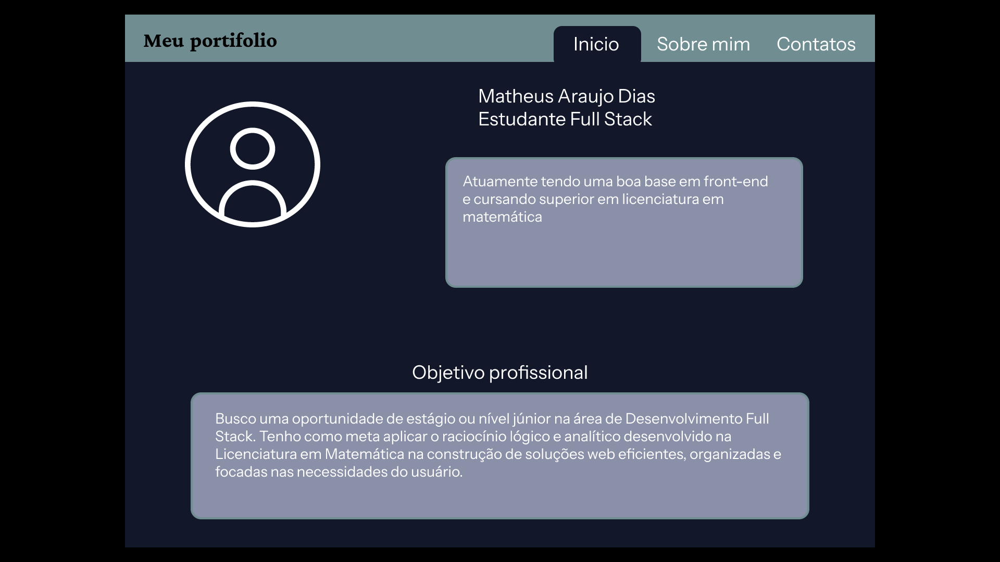
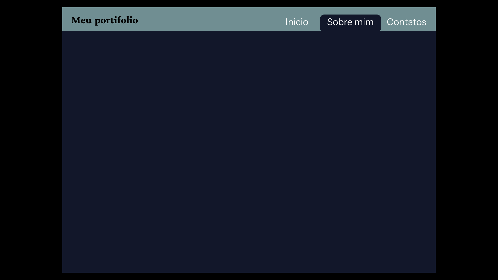
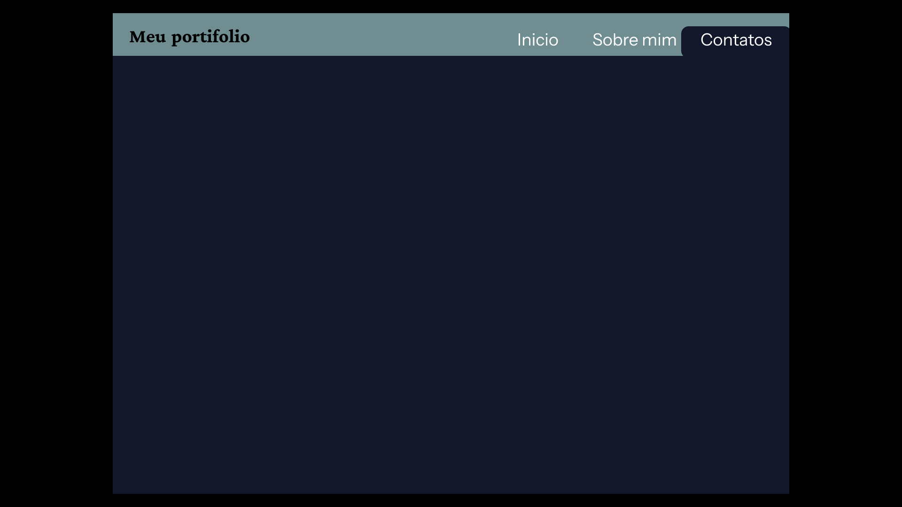

# Protótipo de Portfólio Profissional 🚀

Este repositório contém a documentação e o protótipo inicial (wireframe) do meu portfólio profissional, desenvolvido durante a etapa de design de interface e organização de conteúdo no Figma.

O objetivo do projeto é estruturar visualmente minhas informações acadêmicas, metas de carreira e competências técnicas/comportamentais antes da fase de desenvolvimento de código.

---

## 🔗 Link do Protótipo no Figma

Você pode navegar pelo protótipo interativo diretamente no Figma através do link abaixo:

👉 **[Acessar Protótipo Interativo no Figma](https://www.figma.com/design/xtoRg2InVNNKHg9CiQdsyR/portifolio?node-id=0-1&t=Hv3YbEl8hgEqL7sM-1)**

*(Nota: Lembre-se de substituir o link acima pelo link público do seu arquivo no Figma em "Share" > "Anyone with the link can view")*

---

## 📸 Capturas de Tela do Protótipo

Abaixo estão as visualizações das telas desenvolvidas no protótipo:

### 1. Tela Inicial (Início / Apresentação & Objetivo)

*Apresentação principal com avatar conceitual, biografia resumida e seção de objetivo profissional.*

### 2. Tela de Detalhes (Sobre Mim & Formação)

*Navegação focada na trajetória acadêmica (Licenciatura em Matemática e Qualificação Full Stack) e histórico pessoal.*

### 3. Tela de Contatos & Habilidades

*Seção direcionada para informações de contato, redes profissionais e botões de ação.*

> *Nota: O protótipo está em fase de refinamento e expansão de conteúdo visual.*

---

## 🛠️ Estrutura e Conteúdo do Projeto

O protótipo contempla as seguintes seções principais:

- **Sobre mim:** Nome completo (**Matheus Araujo Dias**), avatar de perfil, biografia com foco na transição/combinação entre Matemática e Desenvolvimento Web.
- **Objetivo Profissional:** Aplicação do raciocínio lógico-analítico da Matemática na construção de aplicações web eficientes e funcionais como Desenvolvedor Full Stack Júnior / Estagiário.
- **Formação Acadêmica:** 
  - Licenciatura em Matemática (Ensino Superior - Cursando)
  - Qualificação Profissional em Desenvolvimento Full Stack (Cursando)
- **Habilidades & Contato:** Organização em Hard/Soft Skills e meios de comunicação direta.

---

## 🧰 Ferramentas Utilizadas

- **Design de Interface:** [Figma](https://www.figma.com/) (Prototipagem, Auto Layout e Wireframing)
- **Auxílio de Inteligência Artificial:** Google Gemini (Estruturação de documentação, revisão de textos de microcopy e paleta de cores dark mode)
- **Versionamento e Hospedagem:** [GitHub](https://github.com/)

---

## 💡 Créditos e Uso de IA

- **Uso de IA Generativa:** A Inteligência Artificial (Gemini) foi utilizada como ferramenta de apoio para a organização estrutural do layout, sugestões de contraste/paleta de cores escuras e elaboração da documentação técnica no `README.md`.
- **Inspirações:** Referências visuais e de navegação baseadas nos padrões modernos de UI/UX para portfólios de desenvolvedores.

---

## 👤 Autoria e Contato

**Matheus Araujo Dias**  
*Estudante de Desenvolvimento Full Stack & Licenciando em Matemática*

- **GitHub:** [BetoneiraGames](https://github.com/betoneirasegames)
- **E-mail:** [betoneirasegames@gmail.com](mailto:betoneirasegames@gmail.com)
